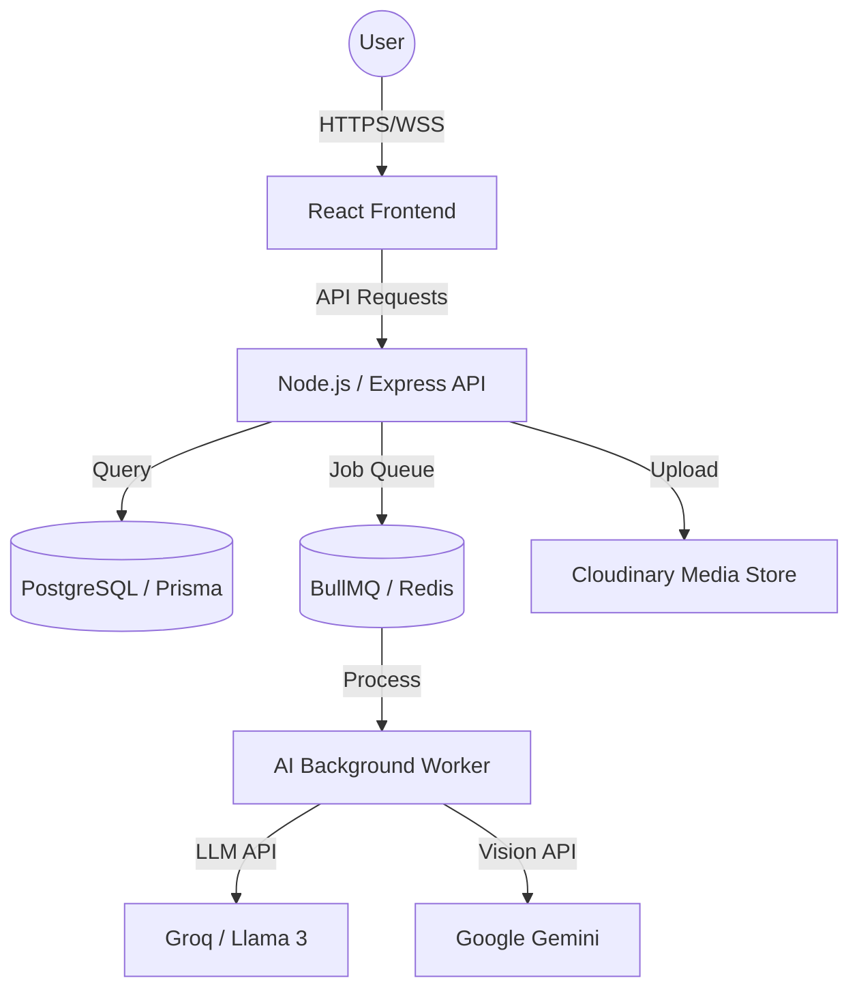

# 📸 Photodiary: Enterprise AI-Powered Life Companion

[](https://opensource.org/licenses/MIT)
[](https://nodejs.org/)
[](https://reactjs.org/)
[](https://groq.com/)

Photodiary is a sophisticated, privacy-first journaling platform that leverages advanced LLMs to transform your daily reflections into structured life insights. Designed with a premium "Glassmorphism" aesthetic, it acts as both a secure vault for your memories and an empathetic AI companion.

---

## 🌟 Key Features

### 🧠 Empathic AI Companion
- **Real-time Voice/Text Chat**: Engage in deep, multi-turn conversations with a life companion that remembers your context and supports your growth.
- **Automated Journaling**: The AI can automatically synthesize your conversations into poetic, structured diary entries.

### 📊 Deep Insights & Analytics
- **Mood Tracking**: Visualizes emotional trends over 14 and 30-day windows.
- **Tag Cloud & Patterns**: Automatically extracts themes like "Workout," "Family," or "Productivity" from your text.
- **Streak Management**: Gamified consistency tracking to encourage daily reflection.

### 📁 Advanced Memory Management
- **Smart Collections**: Organize memories into "Albums" with automated preview thumbnails.
- **Global Search**: Instantly find any moment using full-text search across your history.
- **Bucket List & Goals**: Track your long-term aspirations alongside your daily thoughts.

### 🔐 Enterprise-Grade Security
- **JWT Authentication**: Secure, token-based session management.
- **Push Protection**: Automated scanning to prevent secrets from reaching version control.
- **Privacy First**: All entries are private by default with granular share controls.

---

## 🏗️ Technical Architecture



### 💻 Technology Stack
- **Frontend**: React 18, Vite, Framer Motion (Animations), Lucide (Icons), TailwindCSS.
- **Backend**: Node.js, Express, Socket.io (Real-time), BullMQ (Background Jobs).
- **Database**: PostgreSQL with Prisma ORM.
- **AI/ML**: Groq SDK (LLM), Google Generative AI (Vision), Cloudinary (Image Optimization).
- **Security**: Helmet.js, Bcrypt, JWT, XSS Filters.

---

## 🚀 Getting Started

### Prerequisites
- Node.js (v20 or higher)
- PostgreSQL instance
- Redis (for background AI processing)
- Groq & Google Cloud API Keys

### Installation

1. **Clone the repository**:
   ```bash
   git clone https://github.com/your-username/Photodiary.git
   cd Photodiary
   ```

2. **Backend Setup**:
   ```bash
   cd diary_backend
   npm install
   cp .env.example .env # Add your keys
   npx prisma generate
   npx prisma migrate dev
   npm run dev
   ```

3. **Frontend Setup**:
   ```bash
   cd ../frontend
   npm install
   npm run dev
   ```

---

## ☁️ Deployment
For a full production deployment guide (Render + Vercel + Neon), see our **[Deployment Documentation](./deployment_guide.md)**.

---

## 🛠️ Roadmap
- [ ] **Mobile App**: React Native integration for on-the-go logging.
- [ ] **Advanced Vision**: Real-time object detection and storytelling from uploaded photos.
- [ ] **Multi-lingual Support**: AI companion support for 50+ languages.
- [ ] **End-to-End Encryption**: Optional E2EE for ultra-secure "Gold" users.

---

## 📄 License
This project is licensed under the MIT License - see the [LICENSE](LICENSE) file for details.

---

**Built with ❤️ by the Photodiary Team.**
